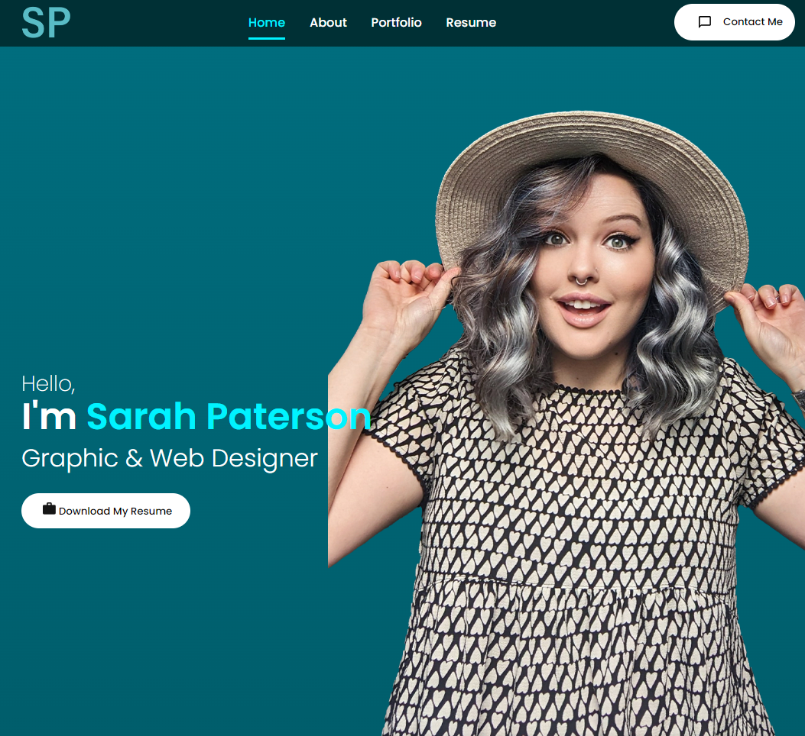
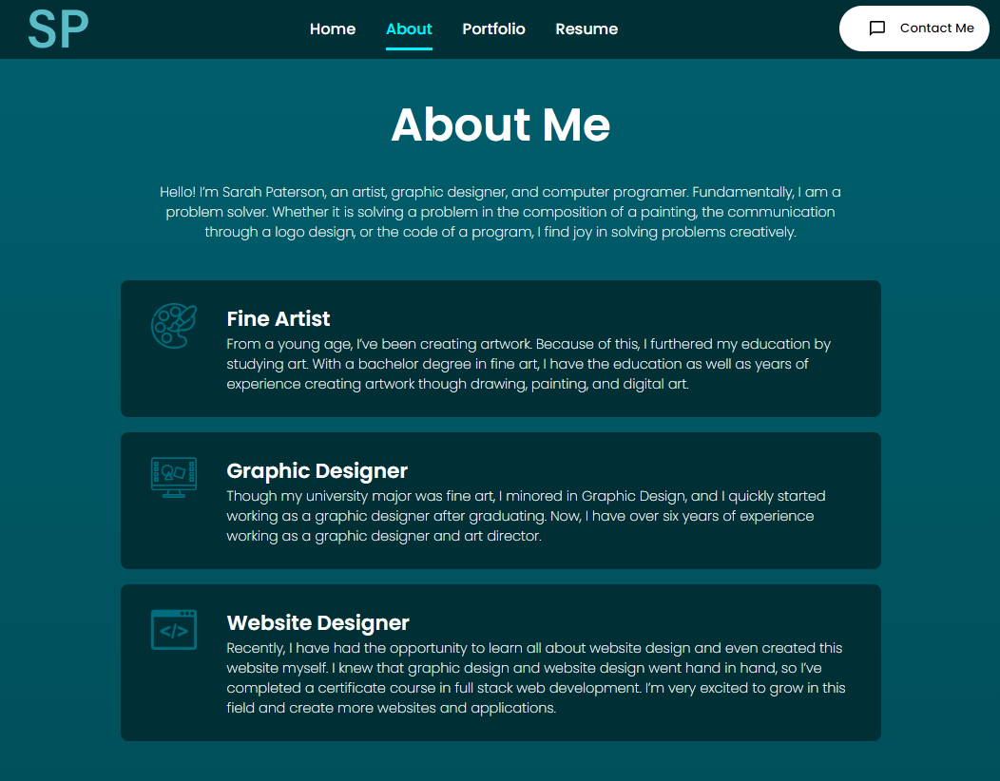
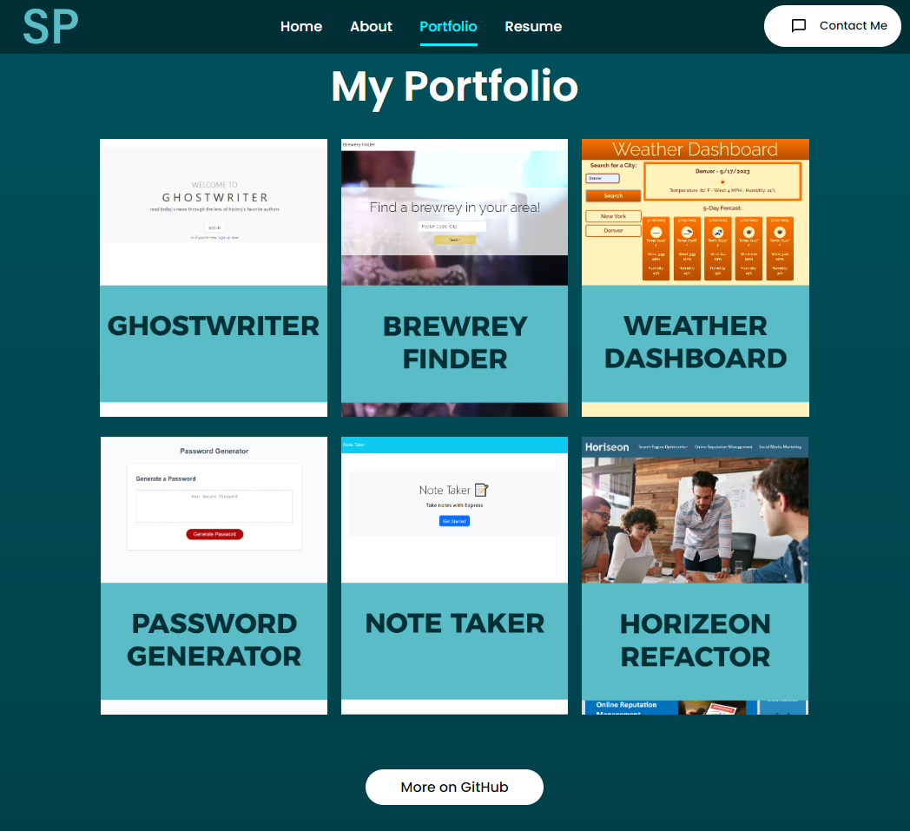
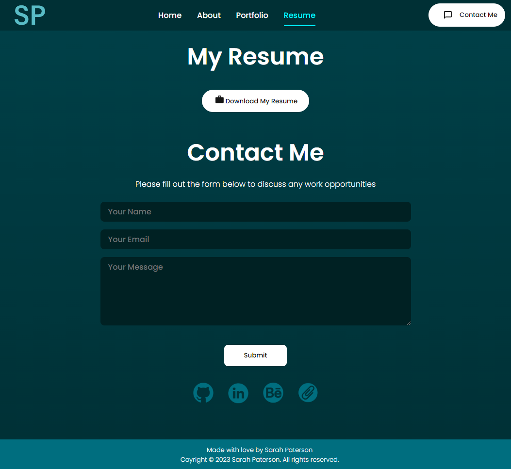

# Sarah Paterson Portfolio

## What this portfolio is all about

This website, with reactjs, is designed to provide a single landing page providing future employers information about me, examples of my work, a way to contact me, and a resume ready to be downloaded.

My motivation was to have all my professional qualities and contact information in a single, visually appealing, and easy to use space. So, I built this project to centralize that information and give future employers ease of access to my information.

[Here is a link to the live webpage](https://peaceful-beyond-53159-0de07fbc74b1.herokuapp.com/).

## Table of Contents

- [Usage](#usage)
- [Credits](#credits)
- [License](#license)

## Usage

### Intro

Welcome to my portfolio! Here’s the intro page where you can use the navigation bar and directly download my resume.

### About Me

Here’s more about me and the different work I do

### Portfolio

Check out some of my recient projects. The link takes you directly to the live webpage of each of the projects, but there is also a button linking to my whole Github Repository

### Resume and Contact Me

Here is another opportunity to download my resume as well as contact me. You can contact me directly using this email form. I also have links to my Github, Linked In, Behance, and another download link for my resume at the bottom.

## Credits

How To Make Portfolio Website Using React JS | Create React Portfolio Website: https://youtu.be/4ag1LsgIUc0?si=7xCHJYk9KWReI0sa

Download PDF file in ReactJS: https://www.geeksforgeeks.org/how-to-download-pdf-file-in-reactjs/

Helpful Resources:
W3 School’s information about JavaScript: https://www.w3schools.com/js/default.asp
Stack Overflow’s answered questions about JavaScript: https://stackoverflow.com/
MDN’s information on JavaScript: https://developer.mozilla.org/en-US/
Google.com helping me find the above resources
The Bootcamp gitLab DU-VIRT-FSF-PT-04-2023-U-LOLC repository

The README template I used was provided by The Full-Stack Blog: https://coding-boot-camp.github.io/full-stack/github/professional-readme-guide

## License
MIT Licence